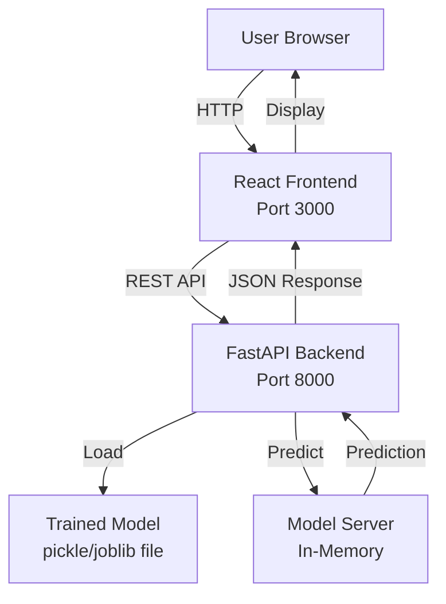

# Design Document: House Price Prediction Website

## Overview

This design document specifies the architecture and implementation details for converting an existing Python Linear Regression model into a full-stack web application. The system enables users to input property characteristics through a React-based web interface and receive instant price predictions from a FastAPI backend serving a pre-trained machine learning model.

### System Components

The application consists of three primary components:

1. **Frontend (React)**: Single-page application providing the user interface for property data entry, prediction display, and model information viewing
2. **Backend (FastAPI)**: REST API server handling prediction requests, input validation, and health monitoring
3. **Model Server**: In-memory model loading and serving component integrated within the FastAPI backend

### Key Technologies

- **Frontend**: React 18+, React Router for navigation, Axios for HTTP requests, CSS3 for responsive design
- **Backend**: FastAPI, Pydantic for request/response validation, Uvicorn ASGI server
- **Model Serving**: scikit-learn, pickle/joblib for model serialization
- **Deployment**: Docker, docker-compose

## Architecture

### High-Level Architecture



### Component Interaction Flow

**Prediction Request Flow**:
1. User enters property details in the Frontend form
2. Frontend validates input client-side
3. Frontend sends POST request to `/predict` endpoint
4. Backend validates request payload with Pydantic
5. Backend transforms input to model format
6. Model Server generates prediction using in-memory model
7. Backend calculates confidence metrics
8. Backend returns JSON response with prediction and metrics
9. Frontend displays formatted results

**Health Check Flow**:
1. Frontend (or monitoring tool) sends GET request to `/health`
2. Backend verifies model is loaded in memory
3. Backend returns health status JSON

**Startup Flow**:
1. Backend process starts
2. Model Server loads trained model from file path
3. Model validates during deserialization
4. Backend logs success or failure
5. Backend starts listening on configured port

## Components and Interfaces

### Frontend Components

#### 1. App Component
- **Responsibility**: Root component managing routing and global state
- **Routes**:
  - `/` - Home page with prediction form
  - `/about` - Model information page
- **State**: None (stateless routing container)

#### 2. PredictionForm Component
- **Responsibility**: Property details input form with validation
- **Props**: None
- **State**:
  - `formData`: Object containing square_footage, bedrooms, bathrooms, location, year_built
  - `errors`: Object mapping field names to validation error messages
  - `isSubmitting`: Boolean indicating request in progress
  - `isValid`: Boolean indicating all fields pass validation
- **Methods**:
  - `handleInputChange(field, value)`: Updates field value and validates
  - `validateField(field, value)`: Returns error message or null
  - `validateForm()`: Returns true if all fields valid
  - `handleSubmit()`: Sends prediction request to backend
- **Validation Rules**:
  - square_footage: numeric, 1-100000
  - bedrooms: integer, 0-20
  - bathrooms: numeric, 0-20, precision 0.5
  - location: alphanumeric + spaces/commas/periods/hyphens/apostrophes, max 200 chars
  - year_built: integer, 1800 to (current_year + 1)

#### 3. PredictionResult Component
- **Responsibility**: Display prediction results with confidence metrics
- **Props**:
  - `prediction`: Object containing predicted_price and confidence_metrics
  - `loading`: Boolean
  - `error`: Error object or null
- **Display Format**:
  - Predicted price as USD currency ($XXX,XXX.XX)
  - Confidence interval with lower and upper bounds
  - Loading spinner during request
  - Error message on failure

#### 4. ModelInfo Component
- **Responsibility**: Display model information and performance metrics
- **Props**: None
- **State**:
  - `modelInfo`: Object containing dataset description, preprocessing steps, metrics
  - `loading`: Boolean
  - `error`: Error object or null
- **Data Source**: Static content embedded in component or fetched from backend `/model-info` endpoint (optional enhancement)

#### 5. ErrorDisplay Component
- **Responsibility**: Reusable error message display
- **Props**:
  - `error`: Object containing type (network/validation/server) and message
  - `onRetry`: Optional callback function for retry button
- **Display**: Error icon, error type label, error message, optional retry button

### Backend Components

#### 1. FastAPI Application (`main.py`)
- **Responsibility**: Application initialization, middleware configuration, route registration
- **Initialization**:
  - Load environment variables
  - Initialize ModelServer
  - Configure CORS middleware
  - Register request size limit middleware (1 MB)
  - Mount routes
- **Error Handlers**:
  - 400 Bad Request handler
  - 413 Payload Too Large handler
  - 500 Internal Server Error handler
  - 503 Service Unavailable handler

#### 2. ModelServer (`model_server.py`)
- **Responsibility**: Load, validate, and serve predictions from trained model
- **Attributes**:
  - `model`: scikit-learn LinearRegression instance
  - `feature_names`: List of expected feature names
  - `is_loaded`: Boolean indicating successful load
- **Methods**:
  - `load_model(path: str) -> None`: Load model from pickle/joblib file
  - `validate_model() -> bool`: Verify model has required attributes
  - `transform_input(data: dict) -> np.ndarray`: Convert request data to model input format
  - `predict(data: dict) -> float`: Generate price prediction
  - `calculate_confidence_interval(prediction: float) -> tuple`: Calculate confidence bounds
- **Error Handling**:
  - FileNotFoundError: Model file not found
  - pickle.UnpicklingError: Invalid model file format
  - AttributeError: Model missing required attributes
  - ValueError: Unknown feature in input

#### 3. Request/Response Models (`schemas.py`)
- **PropertyDetailsRequest** (Pydantic BaseModel):
  - `square_footage: float` (ge=1, le=100000)
  - `bedrooms: int` (ge=0, le=20)
  - `bathrooms: float` (ge=0, le=20)
  - `location: str` (max_length=200, regex pattern for allowed characters)
  - `year_built: int` (ge=1800, le=current_year+1)
  
- **ConfidenceMetrics** (Pydantic BaseModel):
  - `confidence_interval: dict`
    - `lower_bound: float`
    - `upper_bound: float`
  
- **PredictionResponse** (Pydantic BaseModel):
  - `predicted_price: float` (rounded to 2 decimal places)
  - `confidence_metrics: ConfidenceMetrics`
  
- **HealthResponse** (Pydantic BaseModel):
  - `status: str` (enum: "healthy" | "unhealthy")
  - `model_loaded: bool`
  
- **ErrorResponse** (Pydantic BaseModel):
  - `error: str`

#### 4. API Routes (`routes.py`)

**POST /predict**
- **Request**: PropertyDetailsRequest JSON
- **Response**: PredictionResponse JSON (200) or ErrorResponse (400, 500)
- **Logic**:
  1. Validate request with Pydantic (automatic)
  2. Sanitize location field
  3. Transform input for model
  4. Generate prediction
  5. Calculate confidence metrics
  6. Return formatted response
- **Timeout**: 30 seconds (enforced by frontend)
- **Error Cases**:
  - 400: Missing fields, invalid types, out of range values, malformed JSON
  - 413: Request body > 1 MB
  - 500: Model server failure

**GET /health**
- **Request**: None
- **Response**: HealthResponse JSON (200) or ErrorResponse (503)
- **Logic**:
  1. Check ModelServer.is_loaded
  2. Return status based on model state
- **Timeout**: 3 seconds maximum
- **Error Cases**:
  - 503: Model not loaded

### API Interface Specifications

#### POST /predict
```json
Request:
{
  "square_footage": 2500.0,
  "bedrooms": 4,
  "bathrooms": 2.5,
  "location": "San Francisco, CA",
  "year_built": 2015
}

Response (200):
{
  "predicted_price": 850000.00,
  "confidence_metrics": {
    "confidence_interval": {
      "lower_bound": 800000.00,
      "upper_bound": 900000.00
    }
  }
}

Error Response (400):
{
  "error": "Validation error: square_footage must be between 1 and 100000"
}
```

#### GET /health
```json
Response (200):
{
  "status": "healthy",
  "model_loaded": true
}

Response (503):
{
  "status": "unhealthy",
  "model_loaded": false
}
```

## Data Models

### Frontend Data Models

#### FormData
```typescript
interface FormData {
  square_footage: string;  // String for input handling, converted to number
  bedrooms: string;
  bathrooms: string;
  location: string;
  year_built: string;
}
```

#### ValidationErrors
```typescript
interface ValidationErrors {
  square_footage?: string;
  bedrooms?: string;
  bathrooms?: string;
  location?: string;
  year_built?: string;
}
```

#### PredictionResult
```typescript
interface PredictionResult {
  predicted_price: number;
  confidence_metrics: {
    confidence_interval: {
      lower_bound: number;
      upper_bound: number;
    }
  }
}
```

#### ErrorObject
```typescript
interface ErrorObject {
  type: 'network' | 'validation' | 'server' | 'timeout';
  message: string;
}
```

### Backend Data Models

#### PropertyDetails (Internal)
```python
class PropertyDetails:
    square_footage: float
    bedrooms: int
    bathrooms: float
    location: str
    year_built: int
    
    def to_array(self) -> np.ndarray:
        """Convert to numpy array for model input"""
        pass
```

#### ModelMetrics
```python
class ModelMetrics:
    rmse: float
    r2_score: float
    training_samples: int
```

### Database Models

Not applicable - this application is stateless and does not require a database. All predictions are computed on-demand from the in-memory model.

## Correctness Properties

*A property is a characteristic or behavior that should hold true across all valid executions of a system—essentially, a formal statement about what the system should do. Properties serve as the bridge between human-readable specifications and machine-verifiable correctness guarantees.*

After analyzing all acceptance criteria, I've identified the following testable properties. Here's the reflection to eliminate redundancy:

**Validation Properties:**
- Properties 1.2, 1.3, 2.2, 2.5, 10.1-10.5 all test input validation logic
- Consolidation: Combine into comprehensive validation properties that cover frontend and backend validation together
- Properties 10.6 and 2.2 are redundant - backend validation duplicates frontend validation logic

**Error Handling Properties:**
- Properties 2.6, 9.2, 9.3, 9.6, 10.7 all test error response format
- Consolidation: Combine into a property about error response structure

**Format Properties:**
- Properties 3.1, 3.2, 11.2, 11.3 all test numeric formatting and response structure
- Consolidation: Combine into a single response format property

**Sanitization and Transformation:**
- Properties 6.4 and 10.8 both involve data transformation
- Keep separate as they test different aspects (sanitization vs model format transformation)

**Field Name Validation:**
- Property 11.1 tests case-sensitive field names
- Property 6.7 tests unknown feature names
- These are complementary (one tests exact match, one tests unknown) - keep both

### Property 1: Input Validation Range Compliance

*For any* property details input, when validated by frontend or backend validation logic, inputs with numeric fields (square_footage, bedrooms, bathrooms, year_built) within their specified ranges (square_footage: 1-100000, bedrooms: 0-20, bathrooms: 0-20, year_built: 1800 to current_year+1) and location meeting character constraints (alphanumeric, spaces, commas, periods, hyphens, apostrophes, max 200 chars) SHALL be accepted, and inputs outside these constraints SHALL be rejected with field-specific error messages.

**Validates: Requirements 1.2, 1.3, 2.2, 2.5, 10.1, 10.2, 10.3, 10.4, 10.5, 10.6**

### Property 2: Valid Input Enables Submission

*For any* form state, when all required fields (square_footage, bedrooms, bathrooms, location, year_built) are present with valid values, the submit button SHALL be enabled.

**Validates: Requirements 1.4**

### Property 3: Prediction Request Data Integrity

*For any* valid property details, when the frontend sends a POST request to the backend predict endpoint, the request payload SHALL contain all input fields with their exact values preserved.

**Validates: Requirements 2.1**

### Property 4: Prediction Generation for Valid Inputs

*For any* valid property details received by the backend, the Model_Server SHALL generate a numeric prediction result within 1 second.

**Validates: Requirements 2.3, 6.5**

### Property 5: Error Response Structure

*For any* error condition (missing fields, invalid values, model failure), the backend SHALL return an HTTP error status (400, 500) with a JSON response containing an "error" field with a descriptive message that includes relevant details (field name, invalid value, constraint) without exposing sensitive system information (exception details, stack traces, file paths, model internal state).

**Validates: Requirements 2.5, 2.6, 9.3, 10.7, 11.5**

### Property 6: Currency Formatting Consistency

*For any* prediction result containing predicted_price and confidence_metrics (lower_bound, upper_bound), all numeric price values SHALL be formatted as USD currency with exactly 2 decimal places (e.g., $350,000.00).

**Validates: Requirements 3.1, 3.2, 11.2, 11.3**

### Property 7: Error Display Completeness

*For any* HTTP error status (400, 500, 503) returned by the backend, the frontend SHALL display the error type (network, validation, server) and the error message from the response "error" field.

**Validates: Requirements 3.4, 9.2, 9.6**

### Property 8: Error State Clearing

*For any* sequence of prediction requests, when a new request is submitted, all error messages from previous requests SHALL be cleared before displaying new results or errors.

**Validates: Requirements 9.5**

### Property 9: Logging Completeness

*For any* error that occurs during request processing, the backend SHALL log an entry containing timestamp, HTTP status code, request endpoint, input parameters, and exception type.

**Validates: Requirements 9.4**

### Property 10: Input Transformation Correctness

*For any* valid property details received by the Model_Server, the input transformation SHALL produce a numpy array with features in the correct order matching the training data format, with all numeric fields as float/int types and categorical fields properly encoded.

**Validates: Requirements 6.4**

### Property 11: Location String Sanitization

*For any* location string input, the backend sanitization process SHALL remove or escape all characters that are not alphanumeric, spaces, commas, periods, hyphens, or apostrophes before processing.

**Validates: Requirements 10.8**

### Property 12: Malformed JSON Rejection

*For any* request body sent to the `/predict` endpoint that contains invalid JSON syntax, the backend SHALL return HTTP status 400 with an error message indicating malformed JSON.

**Validates: Requirements 5.6**

### Property 13: Case-Sensitive Field Name Matching

*For any* prediction request, the backend SHALL accept only field names that exactly match (case-sensitive) the training data feature names ("square_footage", "bedrooms", "bathrooms", "location", "year_built"), and SHALL reject requests with field names in different cases or with different spellings.

**Validates: Requirements 11.1**

### Property 14: Unknown Feature Detection

*For any* property details containing feature names not present in the training data, the Model_Server SHALL return an error message indicating "Unknown feature: [feature_name]".

**Validates: Requirements 6.7**

## Error Handling

### Error Categories

The application handles four primary error categories:

1. **Validation Errors (HTTP 400)**
   - Missing required fields
   - Invalid field types (non-numeric in numeric fields)
   - Out-of-range values
   - Invalid characters in location field
   - Malformed JSON

2. **Client Errors (HTTP 413)**
   - Request body exceeding 1 MB

3. **Server Errors (HTTP 500)**
   - Model prediction failure
   - Unexpected exceptions during processing

4. **Service Unavailable (HTTP 503)**
   - Model not loaded
   - Backend not ready

### Error Response Format

All error responses follow a consistent JSON structure:

```json
{
  "error": "Descriptive error message without sensitive details"
}
```

### Frontend Error Handling

**Error Display**:
- Network errors: "Connection failure - please check your internet connection and retry"
- Validation errors: Display specific field errors from backend response
- Server errors: "Prediction service unavailable - please try again later"
- Timeout errors: "Request timed out - please try again"

**Error Recovery**:
- Clear error messages when new request is submitted
- Provide retry button for network and timeout errors
- Re-enable form submission after errors

### Backend Error Handling

**Error Logging**:
- Log all errors with timestamp, status code, endpoint, input parameters, exception type
- Log to standard output for successful operations
- Log to standard error for failures
- No sensitive data (stack traces, file paths, model internals) in error responses

**Startup Errors**:
- Model file not found: Log to stderr, exit with non-zero status
- Model deserialization failure: Log to stderr, exit with non-zero status
- Invalid PORT configuration: Log to stderr, exit with non-zero status

### Error Prevention

**Input Validation**:
- Client-side validation before submission (reduces unnecessary backend calls)
- Server-side validation as authoritative check (prevents malicious requests)
- Sanitization of string inputs (prevents injection attacks)

**Defensive Programming**:
- Try-catch blocks around model prediction calls
- Request timeout enforcement (30 seconds frontend, configurable backend)
- Request size limits (1 MB maximum)

## Testing Strategy

### Testing Approach

This application requires a **dual testing approach** combining unit tests for specific examples and property-based tests for universal correctness properties:

1. **Unit Tests**: Verify specific examples, edge cases, error conditions, and integration points
2. **Property-Based Tests**: Verify universal properties across randomized inputs using a PBT library
3. **Integration Tests**: Verify component interactions, infrastructure setup, and end-to-end workflows
4. **UI Tests**: Verify responsive design, accessibility, and visual consistency

### Property-Based Testing Configuration

**Library Selection**: Use `hypothesis` for Python backend tests and `fast-check` for TypeScript/JavaScript frontend tests.

**Test Configuration**:
- Minimum 100 iterations per property test
- Each property test tagged with comment: `# Feature: house-price-prediction-website, Property {number}: {property_text}`
- One test function per correctness property

**Example Property Test Structure (Python/hypothesis)**:
```python
from hypothesis import given, strategies as st

# Feature: house-price-prediction-website, Property 1: Input Validation Range Compliance
@given(
    square_footage=st.floats(min_value=1, max_value=100000),
    bedrooms=st.integers(min_value=0, max_value=20),
    bathrooms=st.floats(min_value=0, max_value=20),
    location=st.text(alphabet=st.characters(whitelist_categories=('Lu', 'Ll', 'Nd')), max_size=200),
    year_built=st.integers(min_value=1800, max_value=2025)
)
def test_valid_inputs_accepted(square_footage, bedrooms, bathrooms, location, year_built):
    # Test that validation accepts inputs within valid ranges
    pass
```

### Unit Testing Strategy

**Frontend Unit Tests**:
- Form validation logic (specific examples of invalid inputs)
- Currency formatting (specific price values)
- Error display component (specific error types)
- Navigation behavior (specific routes)
- Initial state rendering (form disabled state, labels present)

**Backend Unit Tests**:
- Pydantic model validation (specific valid/invalid payloads)
- Model loading (startup with valid/missing/corrupt model file)
- Health endpoint (model loaded/not loaded states)
- CORS configuration (specific allowed origins)
- Request size limits (1 MB boundary)
- Timeout handling (30 second boundary)

**Coverage Goals**:
- Minimum 80% code coverage for backend
- Minimum 70% code coverage for frontend
- 100% coverage of error handling paths

### Integration Testing Strategy

**API Integration Tests**:
- End-to-end prediction flow (frontend → backend → model → response)
- Health check endpoint availability
- CORS header validation
- Error response propagation from backend to frontend

**Infrastructure Integration Tests**:
- Docker image builds successfully
- Docker-compose orchestration
- Environment variable configuration
- Model file loading from configured path

**Test Environment**:
- Use test fixtures for mock model (small, fast-loading)
- Mock external dependencies where appropriate
- Test against actual FastAPI test client

### UI Testing Strategy

**Responsive Design Tests** (not suitable for PBT):
- Snapshot tests at breakpoints: 320px, 768px, 1024px, 1920px
- Verify vertical stacking on mobile (< 768px)
- Verify multi-column layout on desktop (≥ 768px)
- Verify touch target sizes (44x44px minimum on mobile)
- Verify no horizontal scrolling at all supported widths

**Accessibility Tests**:
- Contrast ratio verification (WCAG AA compliance)
- Keyboard navigation
- Screen reader compatibility
- Touch target sizing

**Visual Regression Tests**:
- Design consistency across pages
- Color palette usage
- Typography consistency
- Spacing consistency

**Test Tools**:
- Jest + React Testing Library for component tests
- Cypress or Playwright for E2E tests
- axe-core for accessibility testing
- Percy or Chromatic for visual regression

### Test Organization

```
/backend
  /tests
    /unit
      test_validation.py        # Property tests for validation (Req 10)
      test_model_server.py      # Property tests for model (Req 6)
      test_api_routes.py        # Property tests for API (Req 5, 11)
      test_error_handling.py    # Property tests for errors (Req 9)
    /integration
      test_api_integration.py   # End-to-end API tests
      test_startup.py           # Smoke tests for startup (Req 6, 12)

/frontend
  /src
    /components
      /__tests__
        PredictionForm.test.tsx    # Property tests for validation (Req 1)
        PredictionResult.test.tsx  # Property tests for formatting (Req 3)
        ErrorDisplay.test.tsx      # Property tests for errors (Req 9)
        ModelInfo.test.tsx         # Unit tests for info page (Req 4)
    /e2e
      prediction-flow.spec.ts    # Integration test for full flow
      responsive.spec.ts         # Responsive design tests (Req 7)
      accessibility.spec.ts      # Accessibility tests (Req 8)
```

### Test Data Strategy

**Property Test Generators**:
- **square_footage**: Random floats 1-100000, including edge cases (1, 100000, 0.5, 100000.1)
- **bedrooms**: Random integers 0-20, including edge cases (0, 20, -1, 21)
- **bathrooms**: Random floats 0-20 with 0.5 precision, including edge cases (0, 20, 0.25, 20.5)
- **location**: Random strings with valid/invalid characters, including edge cases (empty, max length 200, special chars)
- **year_built**: Random integers 1800 to current_year+1, including edge cases (1799, 1800, current_year+1, current_year+2)

**Mock Model**:
- Simple linear function for predictable testing
- Fast loading (< 100ms)
- Deterministic predictions for reproducibility

**Test Fixtures**:
- Valid property details examples
- Invalid property details examples (each field)
- Error response examples (each status code)
- Model metrics examples

### Continuous Integration

**CI Pipeline**:
1. Linting (flake8, ESLint)
2. Type checking (mypy, TypeScript compiler)
3. Unit tests (pytest, Jest)
4. Property-based tests (hypothesis, fast-check) - 100 iterations minimum
5. Integration tests
6. Code coverage reporting
7. Docker image builds

**Performance Benchmarks**:
- Model loading time < 10 seconds
- Prediction response time < 1 second
- Health check response time < 3 seconds
- Frontend build time < 5 minutes

